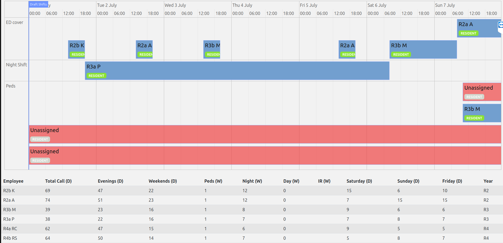

= Residency Scheduling - Modified from quickstart demo Employee Scheduling (Java, Quarkus, Maven)

Schedule shifts to residents across an entire academic year, accounting for availability, min max, balancing etc.. 

This is a rough coding (but works well), yet I figured it may help someone else instead of having to start from scratch. 

Here is data from a final solution for example:

[options="header"]
|===
|Employee |Total Call (D) |Evenings (D) |Weekends (D) |Peds (W) |Night (W) |Saturday (D) |Sunday (D) |Friday (D) |Year

|R2b   |77 |53 |24 |1 |12 |11 |12 |14 |R2
|R2a   |80 |56 |24 |1 |11 |12 |11 |14 |R2
|R3b   |46 |30 |16 |1 |7 |8 |7 |7 |R3
|R3a   |46 |30 |16 |1 |8 |7 |8 |7 |R3
|R4a   |58 |43 |15 |1 |7 |7 |7 |5 |R4
|R4b   |57 |42 |15 |1 |7 |7 |7 |5 |R4
|===

see https://github.com/TimefoldAI/timefold-quickstarts for more info

Constraints implemented:

Overall Strategy:
These constraints collectively aim to create a fair, balanced, and manageable schedule for all residents based on prior precedent and a focus on Chiefs being available during day time hours for both junior resident education and personal development prior to selected fellowship. The AI Timefold system includes personal preferences (desirable and undesirable, unavailable days), implements a fair distribution of work, prevents areas of overwork, and strives to maintain a healthy work-life balance in a demanding 6 resident call schedule. 

General Constraints:

No Overlapping Shifts: Ensures no employee is scheduled for two shifts at the same time.
Unavailable Employee: Employees won't be scheduled on days they've marked as unavailable, reducing conflicts and respecting personal schedules and weeks of vacation.

Unavailable Employee For Pediatrics: Applies the same principle as the general unavailability constraint but specifically targets the Pediatrics away rotation.

Desired Day for Employee: Prioritizes scheduling employees on days they prefer, improving job satisfaction.
Undesired Day for Employee: Avoids scheduling employees on days they've marked as unwanted, respecting personal preferences and commitments.

Penalizing Unassigned Mandatory Shifts

Penalize Unassigned Shifts: Applies penalties for any shifts that are mandatory but not filled, ensuring all necessary work is covered without overburdening employees.

ED/Stat Coverage Constraints:

Prevent ED Cover Before Night Block & Saturday Shifts: Ensures employees are not scheduled for emergency department (ED) coverage right before a night shift or a Saturday shift, helping prevent burnout and ensuring rest.

No 24-Hour Shift After 24-Hour Shift: Prevents back-to-back 24-hour shifts, promoting employee well-being by ensuring adequate rest between demanding shifts.

No Sunday 24-Hour ED Cover Shift After Night Shift Block: Avoids scheduling a demanding 24-hour ED cover shift right after a series of night shifts, allowing for recovery.

Penalize Excess Friday Shifts for R4s: Targets R4 residents specifically, penalizing schedules that overburden them with too many Friday shifts, aiming for a fairer distribution of work.

Penalize 24-Hour Shifts Around Unavailability: Focuses on not scheduling 24-hour shifts close to an employee's unavailable days, excluding night shifts to maintain coverage while respecting personal time.

Minimum/Maximum Rules:

Minimum and Maximum Weekend/Weekday Shifts for Residents: Sets boundaries on the minimum and maximum number of weekend and weekday shifts for residents, ensuring a balance between work and rest, and a fair distribution of workload among different resident years (R2, R3, R4) based on prior precedent.

Minimum and Maximum Night Float Shifts for Residents: Similar to weekend and weekday shifts, these constraints ensure residents are not under or over-utilized in night float shifts, balancing the workload and educational opportunities.

Pediatric Away Rotation Rules:

Pediatric Shifts During Holidays: Penalizes scheduling pediatric shifts during holidays, aiming to distribute holiday work more equitably and respect personal time.

No Overlapping Pediatric Shifts Between Different Residents & No Pediatrics For R3, R4 In June: Respects the transition period for R4 residents moving to fellowships and R3 core exam dates which fluctuate during the month of June.

Balancing Shifts:
Balancing Shifts (Friday ED Cover, Weekend, Evening, Night, Weekend Day Shifts): These rules aim to evenly distribute specific types of shifts among residents of the same year or type, ensuring no single group is overburdened. It includes ensuring fairness in who gets weekend shifts, night shifts, and the potentially less desirable Friday ED cover shifts.

