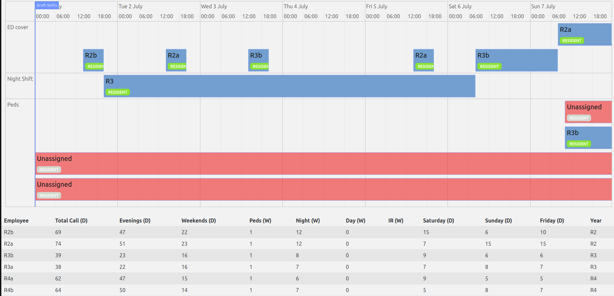

= Residency Scheduling - Modified from quickstart demo Employee Scheduling (Java, Quarkus, Maven)

Schedule shifts to residents across an entire academic year, accounting for availability, min max, balancing etc.. 

This is a rough coding (but works well), yet I figured it may help someone else instead of having to start from scratch. 

see https://github.com/TimefoldAI/timefold-quickstarts for more info
